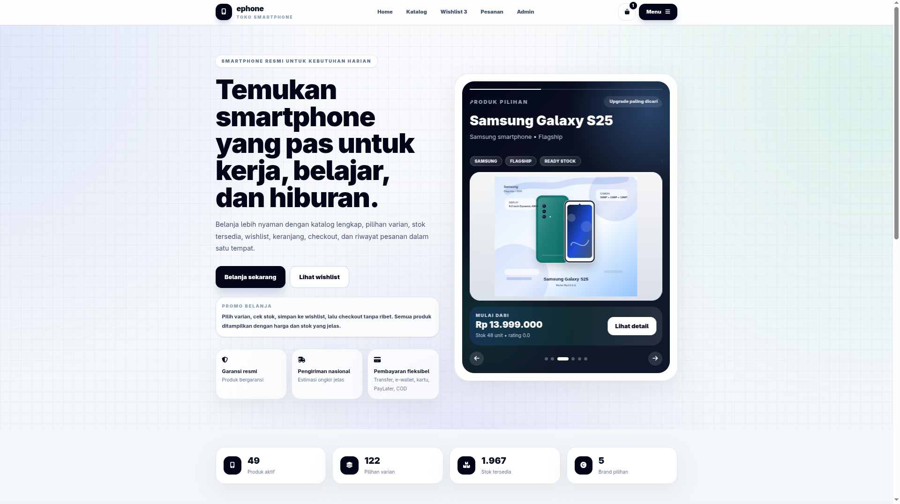

# 📱 ePhone — E-Commerce Smartphone Platform

<div class="flex justify-center items-center">
  
</div>


alian bisa mengakses lewat 👉 **[e-phone.my.id](https://e-phone.my.id)**

> Final Project — Sistem Basis Data (SBD) · Institut Teknologi Sepuluh Nopember (ITS)

ePhone adalah platform e-commerce smartphone berbasis web yang dibangun di atas **MySQL** dengan arsitektur database yang dirancang untuk mensimulasikan sistem transaksi nyata: manajemen produk, checkout multi-metode pembayaran, voucher diskon otomatis, manajemen stok via trigger, hingga laporan penjualan.

---

## 🗂️ Table of Contents

- [Tech Stack](#-tech-stack)
- [Database Architecture](#-database-architecture)
- [Features](#-features)
- [ERD](#-erd)
- [Project Structure](#-project-structure)
- [Setup & Installation](#-setup--installation)
- [API Endpoints](#-api-endpoints)
- [Sample Analytical Queries](#-sample-analytical-queries)
- [Team](#-team)

---

##  Tech Stack

| Layer | Technology |
|---|---|
| Database | MySQL 8.0 |
| Backend | PHP (Native, RESTful API) |
| Frontend | HTML5 · CSS3 · Vanilla JavaScript |
| Tooling | XAMPP |

---

##  Database Architecture

Database `ephone` terdiri dari **19 tabel** dengan desain yang mencakup:

### Core Tables
| Tabel | Deskripsi |
|---|---|
| `brands` | Data merek smartphone (Apple, Samsung, Xiaomi, Vivo, OPPO) |
| `categories` | Kategori produk: Flagship, Mid-range, Entry Level |
| `products` | Katalog 49 produk smartphone |
| `product_specs` | Spesifikasi teknis tiap produk (chipset, kamera, baterai, dll) |
| `product_variants` | Varian produk berdasarkan warna, RAM, storage, dan harga |

### User & Commerce Tables
| Tabel | Deskripsi |
|---|---|
| `users` | Data customer dan admin |
| `vouchers` | Kode voucher dengan persentase diskon dan masa berlaku |
| `orders` | Data pesanan dengan status tracking |
| `order_details` | Detail item per pesanan (relasi ke user dan varian) |
| `cart` | Keranjang belanja sementara |
| `wishlist` | Daftar keinginan produk |
| `reviews` | Ulasan produk oleh customer |
| `activity_log` | Log aktivitas user di platform |

### Payment Tables (Class Table Inheritance)
Menggunakan pola **CTI (Class Table Inheritance)** — tabel `payments` sebagai parent, dengan 5 tabel anak sesuai metode pembayaran:

```
payments (parent)
├── transfer_payments    → Bank transfer + virtual account
├── credit_card_payments → Data kartu kredit
├── cod_payments         → Cash on Delivery
├── ewallet_payments     → GoPay, OVO, LinkAja
└── paylater_payments    → Kredivo, ShopeePayLater
```

### Triggers (5 Triggers)
| Trigger | Event | Fungsi |
|---|---|---|
| `trg_check_stock` | BEFORE INSERT on `order_details` | Validasi stok sebelum order |
| `trg_reduce_stock` | AFTER INSERT on `order_details` | Kurangi stok otomatis |
| `trg_restore_stock_on_cancel` | AFTER UPDATE on `orders` | Kembalikan stok saat order dibatalkan |
| `trg_apply_voucher_discount` | BEFORE INSERT on `orders` | Terapkan diskon voucher ke total |
| `trg_cancel_order_on_failed_payment` | AFTER UPDATE on `payments` | Auto-cancel order jika payment gagal |

### Views & Stored Procedure
- **`product_catalog`** — View gabungan produk, brand, kategori, dan varian
- **`stock_summary`** — View ringkasan stok per varian
- **`GetProductsByBrand(brandName)`** — Stored procedure filter produk per brand

### Indexes (9 Indexes)
Dibuat pada kolom `brand_id`, `category_id`, `release_year`, `product_id`, `color`, `status`, `order_id`, `variant_id`, dan `user_id` untuk optimasi query.

---

##  Features

**Customer**
- Browsing katalog produk dengan filter brand & kategori
- Detail produk beserta spesifikasi dan varian (warna, RAM, storage)
- Keranjang belanja & wishlist
- Checkout dengan 5 metode pembayaran (Transfer, Kartu Kredit, COD, E-Wallet, PayLater)
- Aplikasi kode voucher diskon
- Riwayat pesanan & status tracking
- Review produk

**Admin**
- Manajemen produk (tambah, edit, hapus)
- Dashboard laporan penjualan & revenue
- Monitoring stok

---

## ERD


---

##  Project Structure

```
ephone/
├── mysql_schema.sql          # DDL: schema, triggers, views, indexes
├── mysql_data.sql            # Seed data: 49 produk, 5 brand, 10 order, dll
├── ERD E-Phone.drawio.png    # Entity Relationship Diagram
│
├── db_connect.php            # Koneksi PDO ke MySQL
│
├── api_get_product.php       # GET produk & katalog
├── api_cart.php              # CRUD keranjang belanja
├── api_checkout.php          # Proses checkout + insert ke semua tabel payment
├── api_orders.php            # Riwayat & status pesanan
├── api_payment_status.php    # Update status payment
├── api_login.php             # Autentikasi user
├── api_profile.php           # Data profil user
├── api_reviews.php           # CRUD review produk
├── api_wishlist.php          # CRUD wishlist
├── api_report.php            # Laporan penjualan (admin)
├── api_admin_product.php     # Manajemen produk (admin)
├── api_product_image.php     # Serve gambar produk
│
├── index.html                # Single-page frontend aplikasi
└── assets/
    └── product-images/       # Gambar produk smartphone
```

---

##  Setup & Installation

### Prerequisites
- XAMPP (Apache + MySQL + PHP)
- MySQL 8.0+
- Browser modern

### Langkah Instalasi

**1. Clone repository**
```bash
git clone https://github.com/aadyfan/FINAL-PROJECT-SBD-8-.git
cd FINAL-PROJECT-SBD-8-
```

**2. Pindahkan ke folder htdocs**
```bash
# XAMPP
cp -r . /xampp/htdocs/ephone/
```

**3. Import database**

Buka phpMyAdmin atau MySQL CLI, lalu jalankan secara berurutan:
```sql
SOURCE mysql_schema.sql;
SOURCE mysql_data.sql;
```

Atau via terminal:
```bash
mysql -u root -p < mysql_schema.sql
mysql -u root -p ephone < mysql_data.sql
```

**4. Konfigurasi koneksi**

Edit `db_connect.php` sesuai konfigurasi lokal:
```php
$host = 'localhost';
$db   = 'ephone';
$user = 'root';
$pass = '';          // sesuaikan password MySQL
```

**5. Jalankan aplikasi**

Buka browser dan akses:
```
http://localhost/ephone/
```

### Default Test Accounts

| Role | Email | Password |
|---|---|---|
| Customer | abhista.dyfan@gmail.com | abhista123 |
| Admin | admin@ephone.id | admin123 |

---

##  API Endpoints

| Method | Endpoint | Fungsi |
|---|---|---|
| GET | `api_get_product.php` | Ambil semua produk / detail produk |
| POST | `api_login.php` | Login user |
| GET/POST/DELETE | `api_cart.php` | Manajemen keranjang |
| POST | `api_checkout.php` | Proses checkout (order + payment) |
| GET | `api_orders.php` | Riwayat pesanan user |
| POST | `api_payment_status.php` | Update status pembayaran |
| GET/PUT | `api_profile.php` | Profil user |
| GET/POST | `api_reviews.php` | Review produk |
| GET/POST/DELETE | `api_wishlist.php` | Wishlist user |
| GET | `api_report.php` | Laporan penjualan (admin) |
| GET/POST/PUT/DELETE | `api_admin_product.php` | Manajemen produk (admin) |

---

## 📊 Sample Analytical Queries

Query-query berikut menunjukkan kapabilitas analitik database ePhone:

**Total revenue per brand:**
```sql
SELECT b.brand_name, SUM(od.subtotal) AS total_revenue
FROM order_details od
JOIN product_variants pv ON od.variant_id = pv.variant_id
JOIN products p ON pv.product_id = p.product_id
JOIN brands b ON p.brand_id = b.brand_id
JOIN orders o ON od.order_id = o.order_id
WHERE o.status != 'cancelled'
GROUP BY b.brand_name
ORDER BY total_revenue DESC;
```

**Top 5 produk terlaris:**
```sql
SELECT p.product_name, b.brand_name, SUM(od.quantity) AS total_terjual
FROM order_details od
JOIN product_variants pv ON od.variant_id = pv.variant_id
JOIN products p ON pv.product_id = p.product_id
JOIN brands b ON p.brand_id = b.brand_id
GROUP BY p.product_id, p.product_name, b.brand_name
ORDER BY total_terjual DESC
LIMIT 5;
```

**Revenue per metode pembayaran:**
```sql
SELECT p.method, COUNT(*) AS jumlah_transaksi, SUM(p.amount) AS total_amount
FROM payments p
WHERE p.status = 'success'
GROUP BY p.method
ORDER BY total_amount DESC;
```

**Customer dengan spending tertinggi:**
```sql
SELECT u.full_name, u.email, SUM(od.subtotal) AS total_spending
FROM order_details od
JOIN users u ON od.user_id = u.user_id
JOIN orders o ON od.order_id = o.order_id
WHERE o.status != 'cancelled'
GROUP BY u.user_id, u.full_name, u.email
ORDER BY total_spending DESC;
```

---

## Team

| Nama | NRP |
|---|---|
| Abhista Athallah Dyfan | 5027251006 |
| Asfia Fahmisan | 5027251043 |
| Muhammad Rifqi Fathurrahman | 5027251029 |
| Ndaru Satria Tama | 5027251124 | 

**Mata Kuliah:** Sistem Basis Data (SBD)  
**Institusi:** Institut Teknologi Sepuluh Nopember (ITS) Surabaya  
**Program Studi:** Informasi — HMIT ITS  
**Tahun:** 2026

---

##  License

Project ini dibuat untuk keperluan akademis Final Project Sistem Basis Data ITS 2026.
